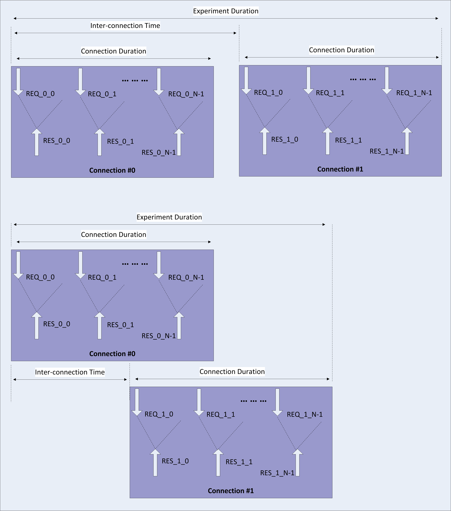
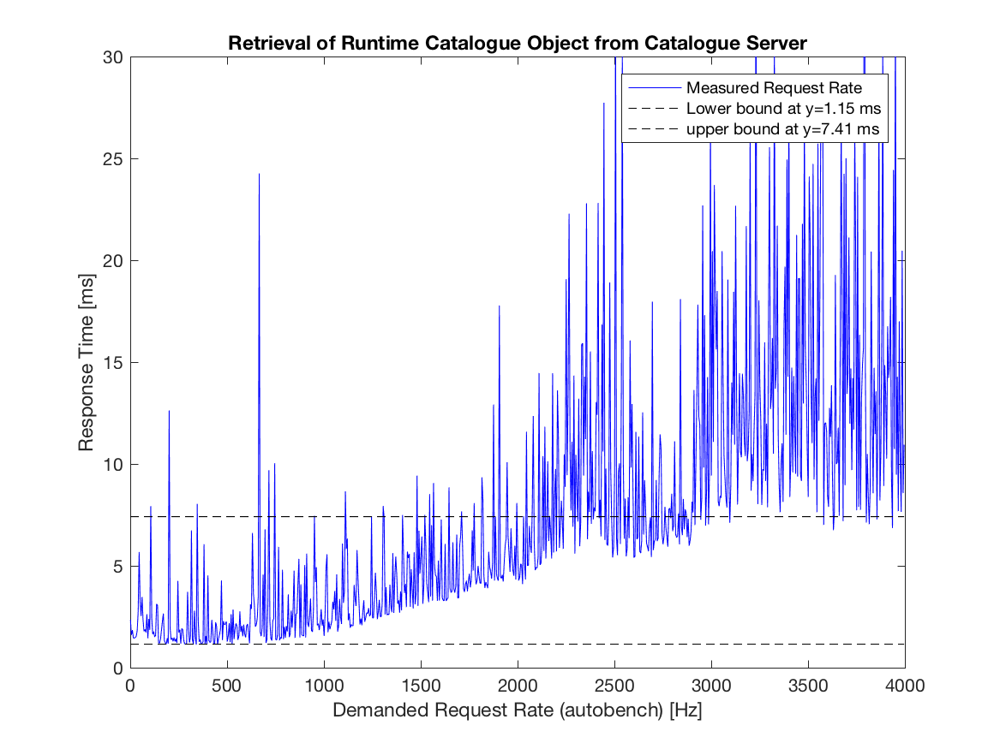
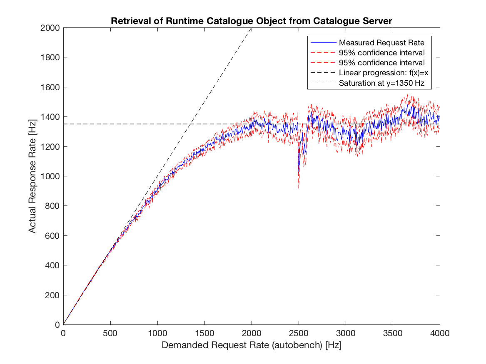
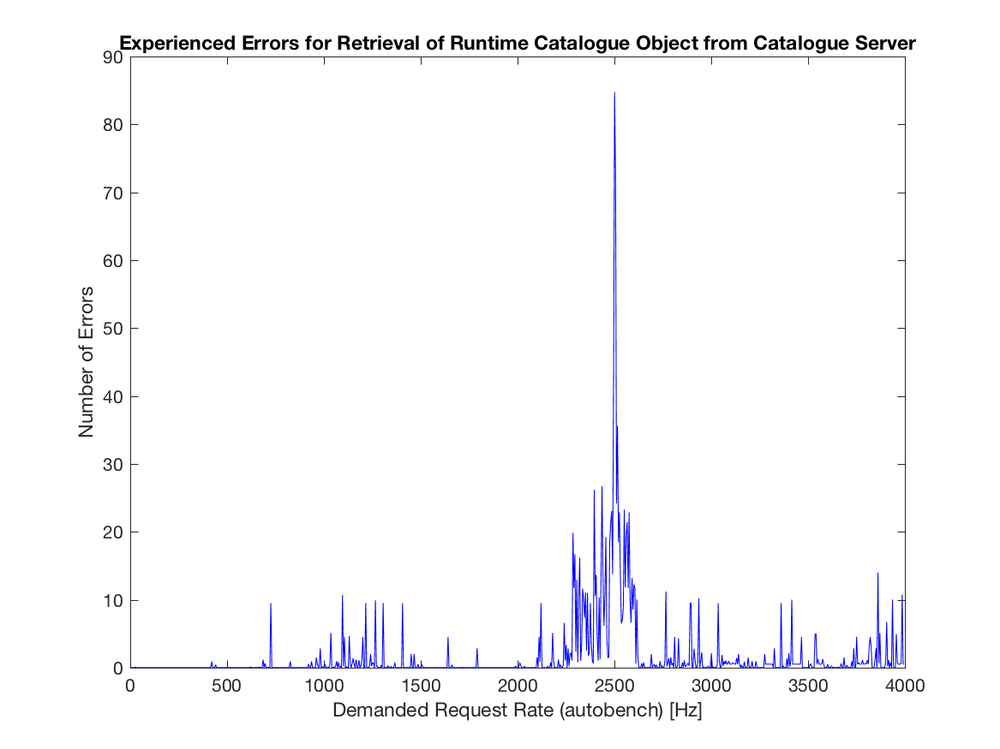
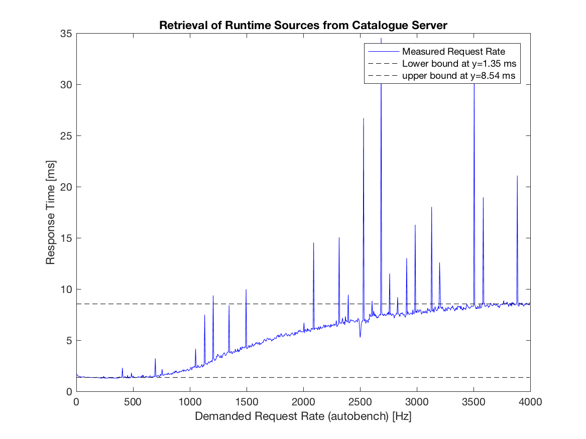
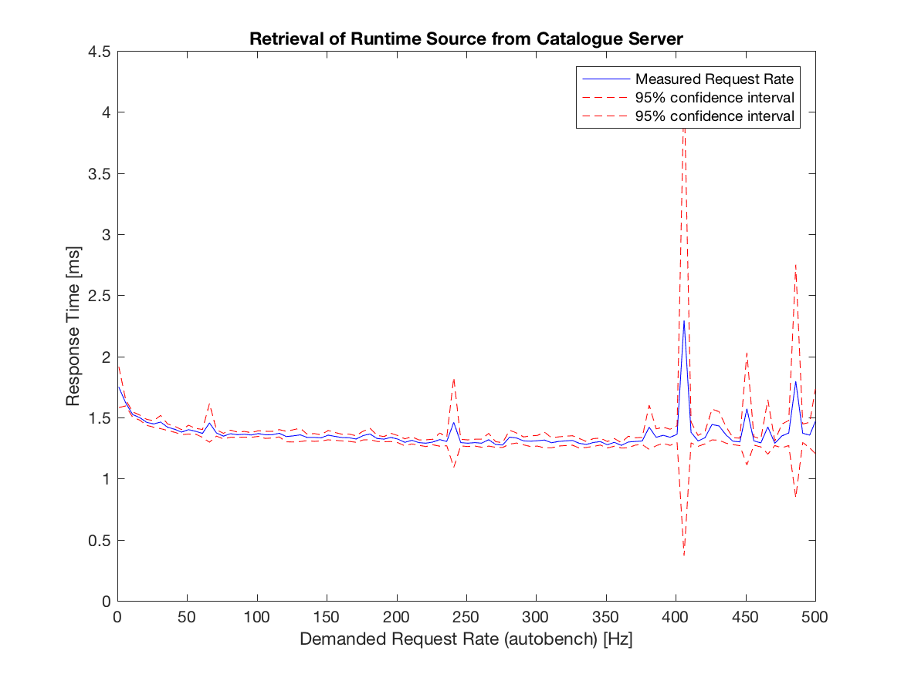
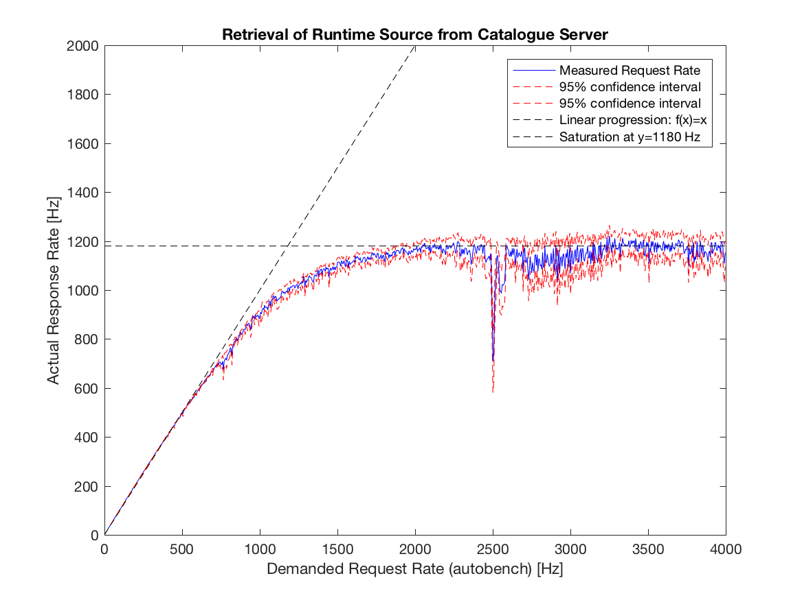
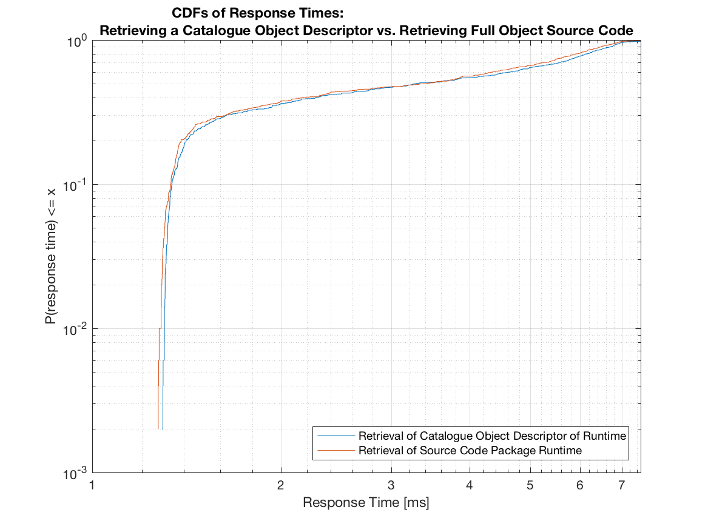

## Catalogue Performance Assessment

### Description of Component

The Catalogue provides the service to store descriptors of Hyperties available for use. It also provides the means for the runtime to obtain (download) the implementation of a Hyperty and ProtocolStubs required for ProtOfly after learning about an Hyperty from the Registry Service.

As such, the Catalogue Service merely stores information and in particular does not need to manipulate any of the stored records. For a detailed description of the internals of the catalogue, please refer to **xxx-add-ref-two-wp4-deliverables-xxx**.

### Methodology and setup

Deliverable D4.1 provides a detailed performance evaluation of the Catalogue using dummy test hyperties and ProtoStubs. As such, the evaluation of the catalogue in this deliverable repeats the methodology as described in [D4.1] but uses actual, larger components served by the catalogue, i.e., actual hypeties and ProtoStubs as developed over the coarse of the the prject are retrieved to evalute the catalogue’s performance. The tests mimic a real world situation in which a client requests its runtime from the Catalogue Server.

#### System under Test

The system under test (SUT) comprises set-up of the catalogue as found in the reTHINK testbed deployment. The set-up resembles a deployment found at a commercial service provider.  In fact, the set-up in the figure below is the testbed setup at Fraunhofer Fokus, which is as a virtulized platform (as a service) run on commercial equipment and network components guarged by a commercial firewall. The used hardware is unchanged with regard to the tests run for [D4.1] and hence not described in detail herein. As in the former assessment of the catalogue, autobench and httperf are used to probe the SUT.


#### Retrieved Catalogue objects

Performance tests were conducted for retrieving all information for a Hyperty Runtime stored in the catalogue.  In a first experiment, the Catalogue Object Descriptor is retrieved from the Catalgoue Server. The descriptor contains all information about the stored object in order to decide at the client if a full retrieval of the object’s source code is necessary.  The actual executalbe code of the Hyperty Runtime is retrieved in a second experiment.

As such, the experiments mimic the real world behavior of the reTHINK system in which clients may retireve a catalogue object descriptor first in order to decide if a locally stored copy of a prefious fetch is still up to date, and in case a newer version of the source is available, perform a full fetch of the catalogue object including the executalbe source code.
The Catalogue Object Descriptor for the Runtime is hown below.  

```
{
  "cguid": "2e810e3c0623102ee7d92056dd12032e",
  "runtimeType": "browser",
  "version": 18.699999999999996,
  "objectName": "Runtime",
  "description": "Description of Runtime",
  "sourcePackageURL": "hyperty-catalogue://catalogue.fokus.fraunhofer.de/.well-known/sourcepackage/Runtime",
  "language": "javascript",
  "hypertyCapabilities": {
    "mic": true,
    "camera": true,
    "sensor": false,
    "webrtc": true,
    "ortc": true
  },
  "protocolCapabilities": {
    "http": true,
    "https": true,
    "ws": true,
    "wss": true,
    "coap": false,
    "datachannel": false
  }
}
```

The sourcpackage object returned by the Catalogue is shown below. Note that the content of the sourceCode field is not shown below; the size of the Runtime’s source, which is retrieved in the second set of experiments, is approx. 153 kB.

```
{
  "encoding": "base64",
  "sourceCodeClassname": "Runtime",
  "sourceCode": “NOT_SHOWN_HERE”,
  "md5": "6ee1b00925aea3365303f6112b62d281"
}
```


### Metrics and Experiment Blueprint

#### Metrics

Deliverable D4.1  **[add-ref-here]**  identifies two functional requirements for the catalogue:
   * "The catalogue service shall allow discovering the information it stores."
   * "The catalogue service should provide fast response times. As querying the Catalogue occurs before an end-to-end communication is established, response times have no immediate impact on an established end-to-end communication."

They transfer into the relevant KPIs, i.e.: average request (vs. response) rate and average response time, as well as numbers of errors encountered when retrieving information nfrom the catalogue.  In addition, the number of erros are recorded for each experiment in order to verify that reported measurements are not biased by any irregularities in the SUT, the testing device, or the communication between the latter two. Deliverable D6.4 **[add-ref-here]** provided a detailed discussion of those KPIs in the context of the performance evaluation of the catalogue. 

As the interface towards the catalogue is http-based, separate metrics for testing conformance are not defined.  The catalogue behavior is conformant if it successfully returns (an existing) http-request for a catalogue element (i.e. hyperty, ProtoStub, etc).

#### Experiment Blueprint

The basic experiment which is used to impose load on the SUT consist of a "testing device" that runs httperf [httperf] to send http-requests to the Catalouge. The following parameters of httperf as considered in the experiment influcence the load imposed on the SUT:
  * rate -- the rate at which (persistent) http connections are invoked;
  * number of connections -- the number of connections to invoke per experiment; and
  * number of calls -- the number of http requests send for each connection.

The following figure illustrates a single connection issues by httperf. For that connection, httperf issues N calls, i.e., http-requests. Calls are issued sequentially, i.e., httperf waits for the response corresponding to REQ_0_x before it issues the following request, i.e., REQ_0_x+1. The time at the testing device between issuing a request and receiving the corresponding response is denoted as Response Time. The figure accounts as well for a potential processing time between receiving a response (e.g.: RES_0_x) and issuing the following request (e.g.: REQ_0_x+1); this time is refered to rho_0. Accordingly, the Inter-Request Time is given by rho_0 + Response Time; and the Call Duration is given by N * Inter-Request Time where Nrefers to the number of calls (i.e., issued http-requests) per connection. As the number of calls per connection is given as a parameter.

For this example, the resulting (average) request and response rate should be equal, i.e.: N / Call Duration.


The following figure illustrates the situation for multiple connections issued by httperf per experiment. The top part of the figure shows the case in which the Connection Duration is shorter than the Inter-Connection Time, the latter being configured via the connection rate (Inter-Connection Time = 1 / rate). Assuming M refers to the number of connections per experiment (which can be configured upon invokation of httperf), and M beeing sufficiently large, the average request rate for the depicted experiment can be approximated by N / Inter-Connection Time or alternatively by N * M / Experiment Duration. (Note that in the figure, M = 2.)



The bottom part of the figure above shows the case in which the Response Time is so long that the resulting Connection Duration is longer than the Inter-Connection Time, i.e., due to the configured rate, a new connection is started before the previous connection finishes. Due to the overlapping connections, we see periods in which http-requests are issued simultaneously from several connections; the experiment duration as shorter as compared to the situation illustrated in the upper part of the figure. Hence, the average request (and response) rate reported for the experiment shown in the bottom part of the figure is higher.

In conclusion, for assing the performance of the Catalogue, one has to set the connection rate to a rather high number in order to enforce the parallization of conections, which in turn steers the number of calls (i.e. requests) per second. Therein, the request rate can be controlled via the number of connections M.

Besides, it should be noted that httperf is not run immediately but is invoced by autobench [autobench], which allows to run several httperf-based experiments in a row where each experiment is invoked with a different connection rate.

For all experiments, the Catalogue is provisioned with catalogue objects as contained in the default database available as part of the "rethink/default-database" docker image. The catalogue objects contain a descriptor and associated code for the "HelloWorldObserver" hyperty. This hyperty descriptor is used in the http-request queries for all experiments.

Each experiment is repeated 200 times to calculate statistic significance of the results, i.e., to obtain confidence values for the reported averages. The corresponding autobench command is:

```
autobench --single_host --host1 ${CATALOGUE_URL} --uri1 ${URI} --low_rate 1 --high_rate 4000 --rate_step 5 --num_call 1 --num_conn 20 --timeout 5 --output_fmt tsv --port1 $PORT --file response_time_numcalls_1_$i.tab 2>&1 | tee response_time_numcalls_1_$i.outputLog
```

### Test Results

#### Catalogue Response Time for Retrieving the Hyperty Runtime Catalogue Descriptor Object

The first assessment aims at determining the Catalogue's response time to a single request to obtain the Catalouge Descriptor (object) for the default Runtime. A single testing device is used to impose load on the SUT. The load in terms of demanded requests per second is constantly increased by enlarging the (connection) rate; each connection consists of one call. Hence, each request is sent via a newly established TCP connection.

The following figure shows the average response time as a function of the demanded request rate for having one call per connection. For loads up to 500 requests per second, the system stablely response on average within 1.38 ms, whereas the lower bound for the respnse time is at 1.15 ms. Analyzing the CDF shows that for requests rates below 500 Hz, the system responds on average in 95% of the time within 1.6 ms.

Starting at 500 reqquests per second, the average response time as well as its variation increases. The average response time saturates at around 7.41 ms (while experiencing large variations in the measurements) for an imposed load larger than 2000 requests per second. 
 
Considering all response times for an imposed load below the system’s saturation rate (i.e. at 2000 Hz), the system responds for 95% within 5.90 ms.
 
Note that the round trip time measured via ping between the testing device and the Catalogue for these measurements is 0.56 ms on average; and that this RTT is included in all of the reported response times.



The next figure plots for lower rates the average response time as well as the corresponging 95-percent confidence levels. We encounter high variations in the expected mean response time as a function of the imposed load. It seems that imposed request rates in multiples of 50 Hz cause high variations in the response time and increase the expected mean for that load as well. Though the actual reason for that behavior is hard to analyze, measurements show that even for the worst case (here at an imposed load of 200 requests per second), the expected mean response time is with 95% confidence below 30 ms, which can be assumed as a rare, worst case expected performance. Even accounting all of the observed variations to the catalogue (and not to any other component of the SUT or the used measurement tools), we can deduct with at least 95% confidence that the mean response time of the Catalogue is below 30ms.


The obersavations regarding the stable state of the system (i.e. below 500 requests per second) and its satuation phase (in between 500 and 2000 requests per second) are also shown in plotting the actual measured request rate over the demanded (i.e. imposed) request rate. Both rates are in linear relation for the stable state, and go into saturation, which is reated at around 2000 imposed requests per second, which result in actual response rates of 1350 Hz.



Finally, looking at reported errors during the experiment (see next figure), all experiments have an imposed rate of less than 410 requests per second run without any reported error. All reported errors are time-out errors; a time-out is triggered by httperf if either a TCP connection could not be established for 5 seconds, or if a response is not received within that timeframe.



As the main intend of the catalogue implementation is to provide a proof-of-concept suitable to evaluate the reTHINK concept at a hackathon, testbed, or pre-commercial trials, in summary, one can assess that such an evaluation is well possible as in either case, it is unlikely that more than 410 devices contact the catalogue simultaneously within one second in order to retrieve a catalogue object descriptor.

#### Catalogue Response Time for retrieving the full Hyperty Runtime Catalogue Object including the executable source code.

Qualitatively, retrieving the full sources of the Hyperty Runtime provides the same results as just retrieving the catalogue object descriptor of the Hyperty Runtime.  Measurement results show a steady state phase for request rates below 600 requests per second; the average response time here is 1.35 ms.  The latter is 15% higher than for just retrieving the catalogue descriptor object, which accounts for the additional 150 kB of source code contained in the response. The response time saturates at roughly 8.54 ms for a demanded request rate of 3500 demanded requests per second. The circumstances that this demanded request rate is larger as for requesting the significantly smaller catalogue object descriptor seems to be caused by seeing less variations in response times as compared to the previous set of experiments. Having responses larger in size seems to stableize the process of generating the responses as copying message in memory becomes more significant. The behavior is consistent with expectations as the actual measured rate of received responses per time interval decreases for larger responses as shown later.



Looking at the following figuer, which plots for lower rates the average response time as well as the corresponging 95-percent confidence levels, we see that for rates lower than 400 requests per second, confidence levels do not overlap with conficendence levels at higher rates for which the SUT is saturated; hence we may deduct at 95% certainity that for rates lower than 400 requests per second, the expected mean response time is 1.35 ms and is constant with respect to the imposed load.



The measured actual response rate for retrieving the "mere" catalgogue descriptor object or the full source code of the default hyperty saturate at approx 2500 demanded requests per second.  Whereas in the former case, we measure an actual response rate of 1350 Hz, the reate decreased for a full retrieval of the hyperty runtime's source code to 1180 Hz. 



Finally, evaluating the number of errors encountered while requesting the full hyperty runtime source code, the Catalogue implementations performs nearly without any error in the steady phase (only 2 errors encountered for a total of 20000 experiments within the systems steady phase).


### Conclusions and recommendations

The goal of the Catalogue service is to store and provide descriptors of Hyperties, Runtimes, ProtoStubs, etc. available for use and to allow downloading their source code. The implementation of the Cataologue service assures response times in the order of a few milli-seconds. As seen in the following figure, downloading a the full source code of an Hyperty, Runtime, or ProtoStub only marginily effects the Catalogue's response time (here in the sub-one-millisecond order).



As such, the implementation of the Catlogue is responsinve enough not to noticeable effect the establishment of end-to-end communication. 

The implementation of the Catalogue service provides stable response times that are invariant against request rates below 500 Hz. Response times linearly increase from around 1.15 ms to around 8.54 ms for response rates up to 3000 Hz.  As such, the implementation of the catalogue suits large scale proof-of-concept (pre-commercial) set-ups.  It should be noted that this performance limitations is with regard to the number of simultaneous requests within a second and not with regard to the number of devices supported in a test bed.  Statistically, a test bed may support a far larger number of devices as not all of them are likely to contact the Catalogue server simultaneously. In case a given deployment needs to server more than 500 (respectively 3000) requests within a one-second time frame, a deployment may evaluate "load distribution mechanisms" as, for example, natively offered by apache servers, which may forward incoming http-requests on a round-robin base to several servers (here catalogues) in the backend.

